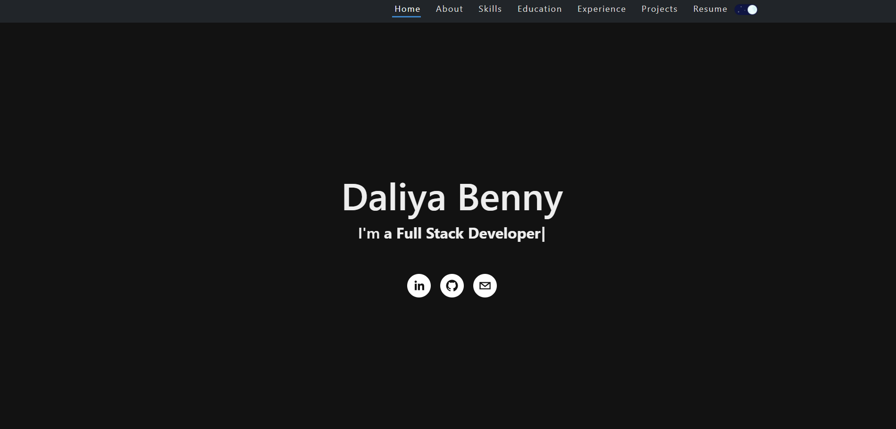

# Portfolio    
A portfolio of work can showcase your skills and talents to employers looking to fill a part-time or full-time position. An effective portfolio highlights your strongest work as well as the thought processes behind it.

## Setup

From your command line, first clone React Portfolio

```bash
# Clone the repository
$ git clone <repoURL>

# Move into the repository
$ cd Portfolio-React

# Remove the current origin repository
$ git remote remove origin
```

After that, you can install the dependencies either using NPM 

Using NPM: Simply run the below commands.

```bash
# Install dependencies
$ npm install --force

# Start the development server
$ npm start
```

Once your server has started, go to this url `http://localhost:3000/` to see the portfolio locally.
The page will reload if you make edits.
    
## Prepare the Repo

### Add Homepage to package.json

First we need to open the `package.json` file for the client and add an entry called `homepage`. The value of `homepage` should have `{username}` as your GitHub username, and `{repo-name}` as the name of the GitHub repository you created: 

```
https://{username}.github.io/{repo-name}
```

Your updated `package.json` should look something like this:

```text
{
  "name": "my-app",
  "version": "0.1.0",
  "private": true,
  "homepage": "https://daliyaebenny.github.io/my-app",
```

### Install gh-pages and Add Deploy Scripts

To publish your app, you need to install the `gh-pages` npm package. Additionally, you'll need to add a few more scripts to `package.json`. Start by simply adding the `gh-pages` dependency:

```sh
npm i gh-pages
```
**Note:** You will see another package manager called `yarn` suggested by `create-react-app`. `yarn` is very similar to `npm`, but for the sake of consistency we will stick with `npm`.

Now lets add the `predeploy` and `deploy` scripts to `package.json`. 

```text
  "scripts": {
    "predeploy": "npm run build",
    "deploy": "gh-pages -d build",
    "start": "react-scripts start",
    "build": "react-scripts build",
```

## Deploy the Site

Now is the time to deploy the React app to GitHub Pages. To do this, run the following command:

```sh
npm run deploy

```

## Mock-Up

The following image shows the web application's appearance 

   

## Links 
* [*GitHub repository*](https://github.com/daliyaebenny/Portfolio-React.git)   
* [*Deployed Application*](https://daliyaebenny.github.io/Portfolio-React/#/)
